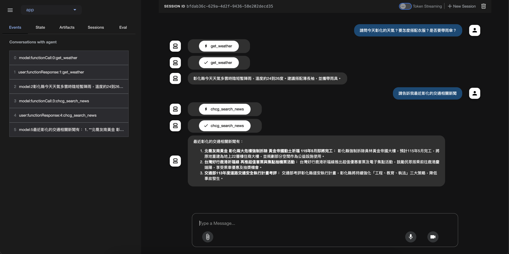

# google-adk-example-tw-gov-data
Google ADK Agent 工具範例 - 使用 Google ADK 去介接台灣政府的 API 和 RSS



## 如何運行？

### Step 1: 複製 `.env` 檔案範例
```bash
cp .env.template .env
```
> 建議：請勿將 `.env` 檔案加入版本控制，避免洩漏機敏資訊。

### Step 2: 編輯 `.env`，設定 API 金鑰
```dotenv
# 中央氣象局氣象資料開放平臺API授權碼
# 請至https://opendata.cwa.gov.tw/user/authkey 申請 API授權碼
# 申請後，將授權碼填入下方的 CWB_API_KEY
CWB_API_KEY="paste-your-actual-key-here"

# If using Gemini via Google AI Studio
GOOGLE_GENAI_USE_VERTEXAI="False"
GOOGLE_API_KEY="paste-your-actual-key-here"

# # If using Gemini via Vertex AI on Google Cloud
# GOOGLE_CLOUD_PROJECT="your-project-id"
# GOOGLE_CLOUD_LOCATION="your-location"  # e.g. us-central1
# GOOGLE_GENAI_USE_VERTEXAI="True"
```

### Step 3: 建置 Docker 映像檔
```bash
docker build -t simonliuyuwei/adk-server-tw-gov-data:v0.0.1 .
```

### Step 4: 執行 Docker 容器
```bash
docker run --rm -d --name google-adk-server-tw-gov-data -p 8000:8000 \
  --env-file .env \
  simonliuyuwei/adk-server-tw-gov-data:v0.0.1
```

## 本機測試 API 介面
啟動後，FastAPI Server 將於 `http://localhost:8000` 提供 API 服務。
你可以查看 `http://localhost:8000/docs` SwaggerUI 查看更多資訊。

## 注意事項
- 本範例使用 `adk api_server` 作為主要執行指令，已封裝於映像中。
- `.env.template` 僅提供結構，實際使用請填入正確金鑰。
- 若需支援 Vertex AI，請正確設定 Google Cloud 專案相關環境變數。

本專案為 Google 官方 A2A 架構學習範例，請依實際業務需求進行調整。

## 作者簡介

劉育維（Simon Liu）

為人工智慧解決方案領域的技術愛好者，專注於協助企業如何導入生成式人工智慧、MLOps 與大型語言模型（LLM）技術，推動數位轉型與技術落地如何實踐。​

目前也是 Google GenAI 領域開發者專家（GDE），積極參與技術社群，透過技術文章、演講與實務經驗分享，推廣 AI 技術的應用與發展，目前，在 Medium 平台上發表超過百篇技術文章，涵蓋生成式 AI、RAG 和 AI Agent 等主題，並多次擔任技術研討會中的講者，分享 AI 與生成式 AI 的實務應用。​

My Linkedin: https://www.linkedin.com/in/simonliuyuwei/
